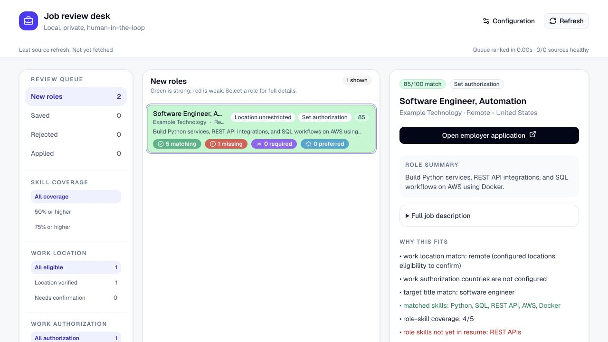

# Hitchcock AI Job Review Kit

[](https://github.com/hitchcockdc/hitchcock-ai-job-review-kit/actions/workflows/python-tests.yml)
[](https://github.com/hitchcockdc/hitchcock-ai-job-review-kit/actions/workflows/dashboard-security.yml)

A local-first, human-in-the-loop workspace for discovering public job postings,
explaining how they match a candidate profile, reviewing opportunities, and preparing
evidence-only resume drafts.

> **Project status:** Alpha. The application is intended for local use and requires a
> person to approve every profile change, resume change, and application decision.



## Why this project exists

Job discovery tools often hide their ranking logic or ask candidates to upload sensitive
documents to a hosted service. Job Review Kit keeps candidate data on the user's machine
and makes every recommendation inspectable.

The workflow is deliberately bounded:

1. Read published employer job feeds.
2. Normalize and deduplicate listings.
3. Apply explicit location, authorization, compensation, and employment preferences.
4. Score both candidate-to-role skill coverage and role-to-candidate preferences.
5. Let the user save, reject, apply, or create an evidence-only resume draft.

It does **not** scrape authenticated job boards, submit applications, contact employers,
or invent experience that is not present in the candidate profile.

## Features

- Public Greenhouse, Lever, Ashby, SmartRecruiters, YC Work at a Startup, and optional USAJOBS connectors.
- Country- and region-aware remote matching, including separate work-authorization review.
- Explainable two-way scoring with required, matched, and missing role skills.
- A compact local dashboard for new, saved, rejected, and applied roles.
- Human-approved skill additions with confirmation and undo.
- Evidence-only DOCX tailoring that preserves the original resume.
- SQLite decision history, source health, stale-role expiration, and duplicate detection.
- Dry-run-first maintenance commands and automated dependency security checks.

## Privacy model

Candidate profiles, resumes, preferences, decisions, tailored documents, and the SQLite
database remain local and are ignored by Git. The application makes outbound requests only
to configured public employer feeds or when the user opens an employer application link.
There is no hosted account, analytics service, or automatic application submission.

Read [Privacy and data handling](docs/PRIVACY.md) before using real candidate information.

## Requirements

- Python 3.11 or newer
- Node.js 22.13 or newer
- npm
- Git

The one-command launcher uses Bash. Windows users can run the API and dashboard commands
in separate terminals.

## Quick start with synthetic data

Clone the repository and install the Python package:

```bash
git clone https://github.com/hitchcockdc/hitchcock-ai-job-review-kit.git
cd hitchcock-ai-job-review-kit
python3 -m venv .venv
source .venv/bin/activate
python -m pip install -e .
```

Install the locked dashboard dependencies:

```bash
cd dashboard
npm ci
cd ..
```

Create a demo database containing only the synthetic fixtures:

```bash
./scripts/create-public-demo.sh demo.db
```

Start the demo dashboard. It uses the synthetic database and does not contact
employer feeds:

```bash
GET_A_JOB_DB=demo.db GET_A_JOB_REFRESH_MINUTES=0 ./scripts/start-dashboard.sh
```

Open [http://localhost:5173](http://localhost:5173). The API listens only on
`127.0.0.1`, and the dashboard proxies `/api` requests to that loopback service.

Before a public release, verify this same synthetic path without using any
candidate data:

```bash
./scripts/verify-public-demo.sh
```

## Configure a private workspace

Initialize the default local database and import a profile:

```bash
python -m get_a_job init-db
python -m get_a_job import-profile examples/profile.example.json
```

Copy the example preferences before entering real values:

```bash
cp examples/preferences.example.json config/preferences.private.json
python -m get_a_job apply-preferences config/preferences.private.json
```

The dashboard Configuration page can then load a private PDF or DOCX resume, review its
extracted profile draft, edit matching preferences, and save approved changes. Private
files under `config/` are excluded by `.gitignore`.

### Geography and authorization

`eligible_countries` controls where the user wants to search. Regional postings match when
their scope includes the configured country; for example, a candidate searching in Spain
can match Spain, EU, or Europe roles while US-only roles are excluded.

`work_authorized_countries` separately records where the user can work without sponsorship.
`consider_sponsorship_roles` controls whether otherwise eligible roles stay reviewable when
sponsorship would be required. Ambiguous postings remain visible with a confirmation label.

## Configure public job sources

Start from the synthetic connector template:

```bash
cp examples/sources.example.json config/sources.private.json
python -m get_a_job fetch config/sources.private.json
```

Connector identifiers refer to public employer feeds. Never place credentials in
`config/sources.json`. USAJOBS requires a key and email header; keep those values only in
the ignored `config/sources.private.json` file using
`examples/sources.private.example.json` as the template.

The local API refreshes configured sources every three hours by default. Set
`GET_A_JOB_REFRESH_MINUTES` before running `./scripts/start-dashboard.sh` to change the
interval.

The dashboard's in-memory eligible-role preview cache is capped at 32 MB by default.
Set `GET_A_JOB_CANDIDATE_CACHE_MAX_MB` (1–1024) before starting the dashboard to set a
different local memory ceiling.

The ranked-role response cache is separately capped at 32 MB by default. Set
`GET_A_JOB_RANKING_CACHE_MAX_MB` (1–1024) before starting the dashboard to change it.

## Matching and review

Generate a command-line shortlist:

```bash
python -m get_a_job matches --limit 20 --per-company 1
```

The score considers:

- coverage of explicitly required and broadly stated role skills;
- target and priority titles;
- configured work location and authorization;
- employment type, compensation, travel, and industry preferences; and
- lightweight signals from the user's saved, rejected, and applied decisions.

The Configuration page exposes the seven base scoring weights as a 100-point allocation.
It separates candidate-to-role skill coverage from role-to-candidate preference fit and
previews every component change against fictional roles before an approved allocation is
saved locally. A separate private preview compares tentative weights against the current
new-role queue without persisting them. Decision-learning adjustments remain a separate,
labeled signal.

Missing job data is reported as unknown instead of being silently treated as a match.
Dashboard filters can separate verified locations, location confirmation, authorized roles,
sponsorship roles, and authorization confirmation.

Record a decision from the CLI when needed:

```bash
python -m get_a_job review greenhouse:example:123 saved --note "Strong platform fit"
python -m get_a_job decisions
```

## Resume tailoring boundary

Tailoring is evidence-only. The tool can reorder existing summary sentences, expertise
items, and reviewer-selected bullets in supported DOCX layouts. It does not add unsupported
skills or rewrite employment history. Every draft must be reviewed and approved before a
separate DOCX is generated; the source resume remains unchanged.

Generated documents are private artifacts and should always be opened and visually reviewed
before use.

## Maintenance

Audit stored descriptions without changing the database:

```bash
python -m get_a_job normalize-descriptions
```

Apply normalization only after reviewing the dry run:

```bash
python -m get_a_job normalize-descriptions --apply
```

The apply command creates a timestamped SQLite backup, updates active job payloads
atomically, and leaves raw source-response history unchanged.

## Development and verification

Run the Python suite:

```bash
PYTHONPATH=src python -m unittest discover -s tests -v
```

Run the dashboard release gate:

```bash
cd dashboard
npm run verify:release
```

For a public release, use the combined gate from a clean private working tree:

```bash
./scripts/verify-release.sh /path/to/clean/public-checkout
```

It runs the Python and dashboard checks, verifies the synthetic demo, and confirms the
public checkout exactly matches the sanitized export.

The gate audits production dependencies, runs the complete dashboard lint and interaction
test suites, and builds the production bundle. GitHub Actions runs equivalent checks for
relevant pull requests and pushes to `main`.

See [Architecture](docs/ARCHITECTURE.md), the [connector contract](docs/CONNECTORS.md),
[Contributing](CONTRIBUTING.md), and [Security](SECURITY.md) for more detail. The
[product tour](docs/PRODUCT_TOUR.md) uses only synthetic data, and the
[roadmap](ROADMAP.md) describes the current direction and non-goals.

## Limitations

- ATS schemas and public endpoints can change without notice.
- Skill and sponsorship detection are deterministic heuristics and require human review.
- Some postings omit salary, dates, country restrictions, or explicit requirements.
- Duplicate detection intentionally favors precision and may miss near-duplicates.
- DOCX tailoring supports recognized layouts and stops rather than risking broad formatting
  damage when a document structure is unknown.
- Hosted deployment and automated application submission are outside the supported scope.

## Support

This is an early-stage open-source project. Read [SUPPORT.md](SUPPORT.md) before opening an
issue, and reproduce defects with synthetic data only.

## License

Copyright © 2026 Hitchcock AI. Released under the [MIT License](LICENSE).
