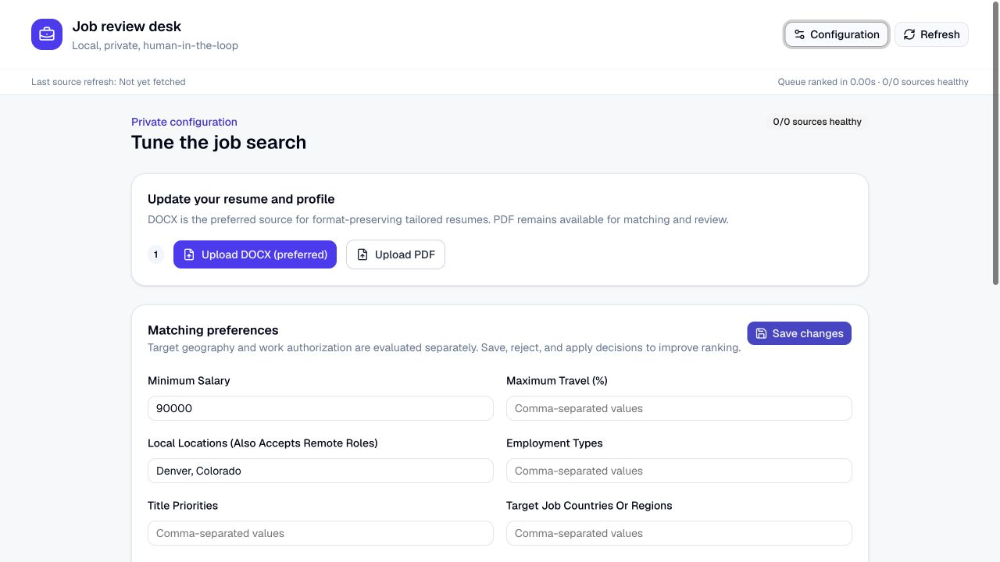

# Product tour

Every image in this tour is generated from the synthetic fixtures under `examples/`. It does
not contain a real resume, candidate profile, job decision, or employer record.

## Review queue

The review workspace keeps queue filters, condensed role cards, and the selected role's
evidence visible together. Scores are explainable, and application actions remain manual.

## Private configuration

The configuration workflow separates resume upload, extracted-profile review, matching
preferences, aliases, and decision history. Profile and resume changes require explicit
approval and remain in the local database and ignored files.

